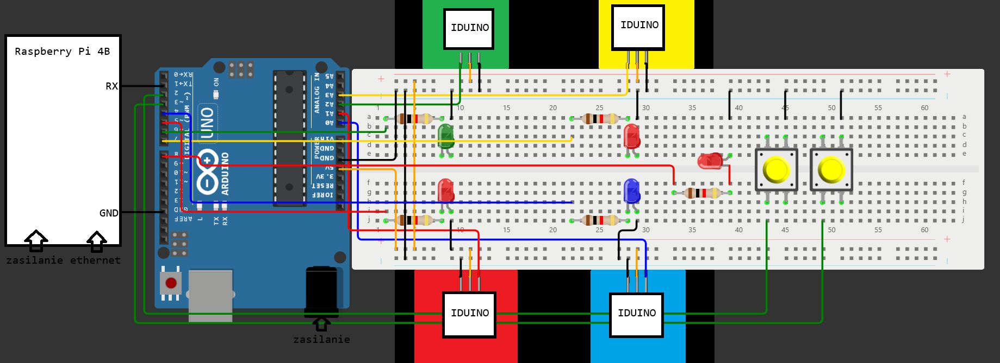
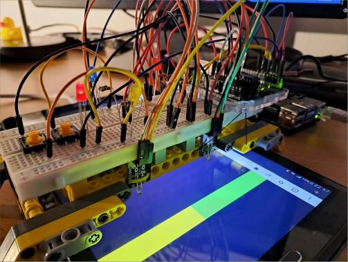
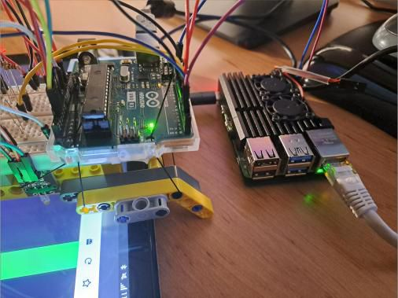
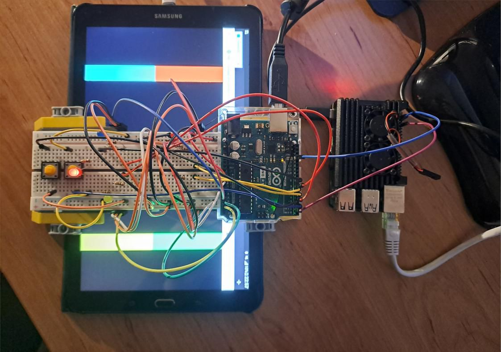
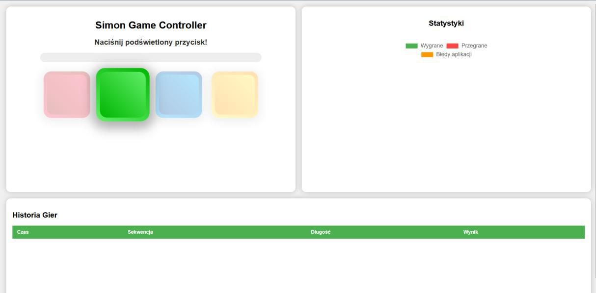
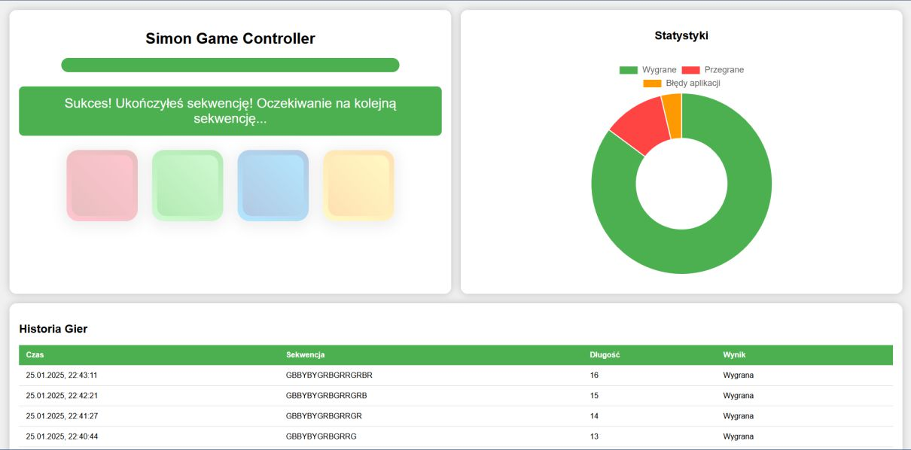

# 🟥🟩🟦🟨 Simon solver

## ℹ️ O projekcie

#### [🇬🇧 English version](#ℹ️-about-the-project)

Projekt powstał na przedmiocie `Systemy wbudowane`, na V semestrze studiów pierwszego stopnia na kierunku Informatyka na Politechnice Poznańskiej.

### 🎮 Gra Simon

Gra polega na odtwarzaniu sekwencji migających światełek. W pierwszej rundzie zapala się jedna lampka; należy wcisnąć odpowiadający jej przycisk. W każdej kolejnej rundzie do starej sekwencji dodawany jest na końcu nowy kolor. Po zakończeniu wyświetlania należy odtworzyć od początku całą sekwencję. W przypadku popełnienia błędu, gra się kończy.

### ➡️ Składowe projektu

* Aplikacja z grą napisana w Scratchu. Jest to najprostsza wersja gry, nie obsługuje przyspieszania z każdą kolejną rundą. (Protip: aplikację można przekonwertować na plik w języku HTML używając strony [TurboWarp Packager](https://packager.turbowarp.org/)).
* Zbudowana z klocków LEGO konstrukcja, dedykowana pod urządzenie, na którym uruchomiona była gra. Na konstrukcji znajdowała się płytka prototypowa z połaczeniami i czujniki natężenia światła.
* Arduino UNO, przetwarzające dane z czujników, obsługujące diody oraz przyciski przerwań.
* Raspberry Pi 4B, na której uruchomiona jest aplikacja wizualizująca postęp w grze. Pokazuje graczowi, który przycisk ma nacisnąć jako kolejny.

### 🛠️ Podstawowy schemat połączeń

  

### 📷 Galeria zdjęć

  
  
  

  
  

### 👥 Autorzy

* [Jakub Pilarski](https://github.com/jpilarski)
* Antoni Sopata
* Patryk Płonkowski

## ℹ️ About the project

#### [🇵🇱 Wersja polska](#ℹ️-o-projekcie)

The project was created for the `Embedded systems` course during the 5th semester of the Bachelor's degree in Computer Science at Poznan University of Technology.

### 🎮 Simon game

The game involves repeating a sequence of flashing lights. In the first round, one light turns on, and you must press the corresponding button. In each following round, a new color is added to the end of the previous sequence. After the lights finish flashing, you must reproduce the entire sequence from the beginning. If you make a mistake, the game ends.

### ➡️ Project components

* A game application written in Scratch. This is the simplest version of the game and doesn't support increasing speed with each round. (Pro tip: you can convert the app into an HTML file using [TurboWarp Packager](https://packager.turbowarp.org/)).
* A LEGO-based structure built to hold the device running the game. The setup included a prototype board with wiring and light intensity sensors.
* An Arduino UNO, responsible for processing sensor data, controlling LEDs, and handling interrupt buttons.
* A Raspberry Pi 4B running an application that visualizes the game progress. It shows the player which button to press next.

### 🛠️ [Basic wiring diagram](#schema)

### 📷 [Gallery](#gallery)

### 👥 Authors

* [Jakub Pilarski](https://github.com/jpilarski)
* Antoni Sopata
* Patryk Płonkowski
